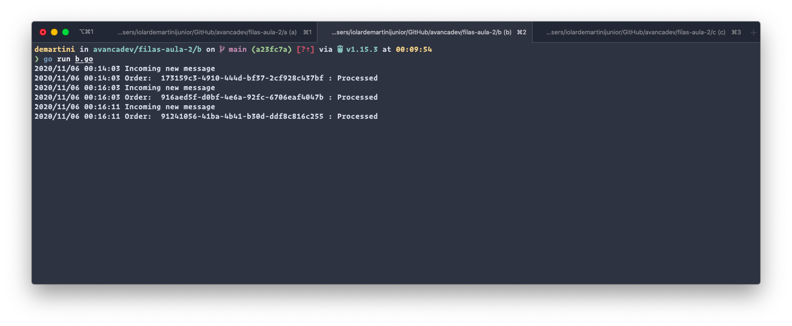
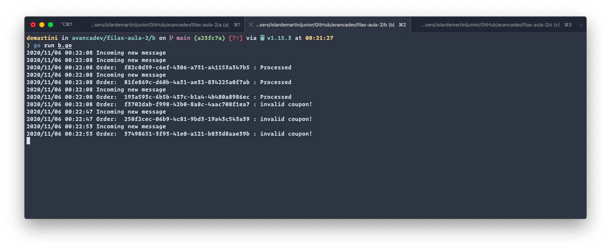
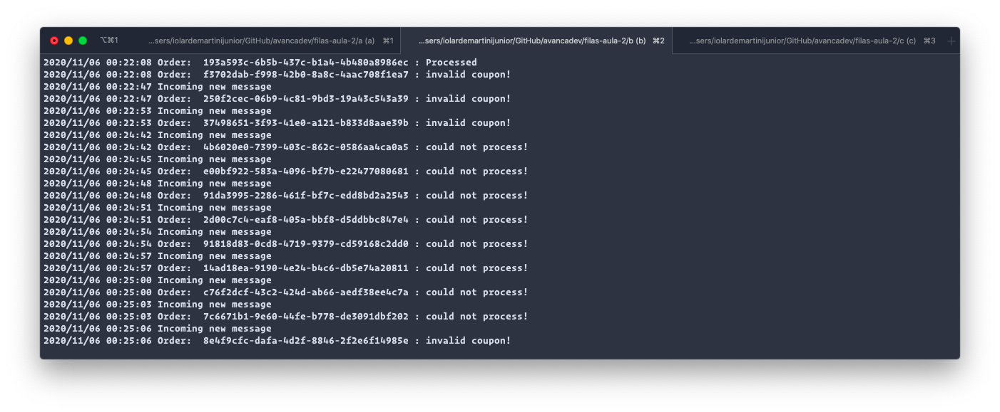

# [AvançaDev](https://avancadev.com.br) <!-- omit in toc -->

## Table of Contents
- [Table of Contents](#table-of-contents)
- [Challenge #1](#challenge-1)
    - [Microservice](#microservice)
- [Challenge #2](#challenge-2)
    - [Processed](#processed)
    - [Invalid](#invalid)
    - [Connection Error](#connection-error)
- [Challenge #3](#challenge-3)
    - [Microservice with Docker](#microservice-with-docker)

## Challenge #1

#### Microservice
- [feat: add microservice d](https://github.com/demartini/avancadev/commit/374ee81df69c3fcf027edb29c4fda00124fa0009)
- [feat: add retry rule if microservice is down](https://github.com/demartini/avancadev/commit/e802d372e126d76462d1f8e317aafa2dc2047885)

## Challenge #2

#### Processed

#### Invalid

#### Connection Error

## Challenge #3

#### Microservice with Docker
- [Microservice A](https://hub.docker.com/r/demartini/avancadev-microservice-a)
- [Microservice B](https://hub.docker.com/r/demartini/avancadev-microservice-b)
- [Microservice C](https://hub.docker.com/r/demartini/avancadev-microservice-c)
- [docker-compose](docker-aula-4/docker-compose.yml)
